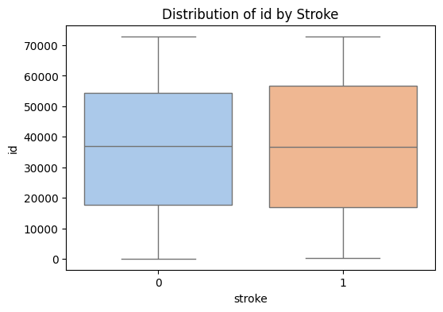

---
jupyter:
  colab:
  kernelspec:
    display_name: Python 3
    name: python3
  language_info:
    name: python
  nbformat: 4
  nbformat_minor: 0
---


1.  Write a program to print out the grade of a person according to the
    following criteria:

-   less than 50: C
-   between 50 and 80: B
-   between 80 and 90: A
-   above 90: A+

Hint: do you have enough information to write a program?


``` python
# Input: Score of the person
score = float(input("Enter the score: "))

# Determine the grade
if score < 50:
    grade = "C"
elif 50 <= score < 80:
    grade = "B"
elif 80 <= score <= 90:
    grade = "A"
else:  # score > 90
    grade = "A+"

# Output the grade
print(f"The grade is: {grade}")
```

    Enter the score: 100
    The grade is: A+

1.  What\'s the output here?

This code will throw a NameError because the variable hour in
print(number_of_minutes(hour)) is not defined. The correct variable name
is hours.

``` python
hours = 3

def number_of_minutes(hours):
  MINUTES_PER_HOUR = 60
  return hours * MINUTES_PER_HOUR

# Changed 'hour' to 'hours' in the function call
print(number_of_minutes(hours))
```

180

1.  Write a function to return the number of hours for a given number of
    days

``` python
def number_of_hours(days):
    HOURS_PER_DAY = 24
    return days * HOURS_PER_DAY

days = 7
print(f"{days} days equals {number_of_hours(days)} hours.")
```

    7 days equals 168 hours.

1.  You are given a series of monthly sales revenue (in thousand USD),
    write a series of functions to compute the following descriptive
    statistics:

-   Mean
-   Median
-   Mode
-   Variance
-   Standard deviation
-   Count
-   Range

``` python
import statistics

sales_revenue = [
    150, 200, 210, 190, 170, 220, 250, 230, 210, 180, 170, 160,
    300, 190, 175, 160, 140, 240, 260, 300, 310, 330, 290, 210
]

def compute_statistics(data):
    mean = statistics.mean(data)
    median = statistics.median(data)
    mode = statistics.mode(data)
    variance = statistics.variance(data)
    std_dev = statistics.stdev(data)
    count = len(data)
    range_value = max(data) - min(data)

    return {
        "Mean": mean,
        "Median": median,
        "Mode": mode,
        "Variance": variance,
        "Standard Deviation": std_dev,
        "Count": count,
        "Range": range_value,
    }

stats = compute_statistics(sales_revenue)
for key, value in stats.items():
    print(f"{key}: {value}")
```

    Mean: 218.54166666666666
    Median: 210.0
    Mode: 210
    Variance: 3064.085144927536
    Standard Deviation: 55.35417910986971
    Count: 24
    Range: 190

1.  You have a dataset of product categories sold in a department store.
    Calculate descriptive statistics describing the data:

-   Total number of products sold
-   Unique product categories
-   Frequencies of each product category
-   Most frequently sold product category

``` python
from collections import Counter

product_categories = [
    "Electronics", "Clothing", "Electronics", "Home & Garden", "Clothing", "Beauty",
    "Clothing", "Electronics", "Toys", "Home & Garden", "Clothing", "Clothing",
    "Beauty", "Electronics", "Toys", "Clothing", "Electronics", "Home & Garden",
    "Electronics", "Clothing", "Beauty", "Toys"
]

def analyze_product_categories(categories):
    total_products = len(categories)
    unique_categories = set(categories)
    category_frequencies = Counter(categories)
    most_common_category = category_frequencies.most_common(1)[0]

    return {
        "Total Products": total_products,
        "Unique Categories": unique_categories,
        "Category Frequencies": category_frequencies,
        "Most Common Category": most_common_category,
    }

category_stats = analyze_product_categories(product_categories)
for key, value in category_stats.items():
    print(f"{key}: {value}")
```

    Total Products: 22
    Unique Categories: {'Clothing', 'Home & Garden', 'Beauty', 'Electronics', 'Toys'}
    Category Frequencies: Counter({'Clothing': 7, 'Electronics': 6, 'Home & Garden': 3, 'Beauty': 3, 'Toys': 3})
    Most Common Category: ('Clothing', 7)

------------------------------------------------------------------------

``` python
from google.colab import drive
drive.mount("/content/drive")
```

    Mounted at /content/drive

``` python
# Import relevant libraries

import numpy as np
import pandas as pd
import seaborn as sns
import matplotlib.pyplot as plt
import warnings
warnings.filterwarnings("ignore")
```

``` python
# Change the path to point to your data location
filepath = "/content/drive/MyDrive/DataCamp/healthcare-dataset-stroke-data.csv"

# Read the CSV file into a Pandas DataFrame
stroke_data = pd.read_csv(filepath)

# Print the DataFrame
print(stroke_data)
```

             id  gender   age  hypertension  heart_disease ever_married  \
    0      9046    Male  67.0             0              1          Yes   
    1     51676  Female  61.0             0              0          Yes   
    2     31112    Male  80.0             0              1          Yes   
    3     60182  Female  49.0             0              0          Yes   
    4      1665  Female  79.0             1              0          Yes   
    ...     ...     ...   ...           ...            ...          ...   
    5105  18234  Female  80.0             1              0          Yes   
    5106  44873  Female  81.0             0              0          Yes   
    5107  19723  Female  35.0             0              0          Yes   
    5108  37544    Male  51.0             0              0          Yes   
    5109  44679  Female  44.0             0              0          Yes   

              work_type Residence_type  avg_glucose_level   bmi   smoking_status  \
    0           Private          Urban             228.69  36.6  formerly smoked   
    1     Self-employed          Rural             202.21   NaN     never smoked   
    2           Private          Rural             105.92  32.5     never smoked   
    3           Private          Urban             171.23  34.4           smokes   
    4     Self-employed          Rural             174.12  24.0     never smoked   
    ...             ...            ...                ...   ...              ...   
    5105        Private          Urban              83.75   NaN     never smoked   
    5106  Self-employed          Urban             125.20  40.0     never smoked   
    5107  Self-employed          Rural              82.99  30.6     never smoked   
    5108        Private          Rural             166.29  25.6  formerly smoked   
    5109       Govt_job          Urban              85.28  26.2          Unknown   

          stroke  
    0          1  
    1          1  
    2          1  
    3          1  
    4          1  
    ...      ...  
    5105       0  
    5106       0  
    5107       0  
    5108       0  
    5109       0  

    [5110 rows x 12 columns]

``` python
stroke_data.info()
```

    <class 'pandas.core.frame.DataFrame'>
    RangeIndex: 5110 entries, 0 to 5109
    Data columns (total 12 columns):
     #   Column             Non-Null Count  Dtype  
    ---  ------             --------------  -----  
     0   id                 5110 non-null   int64  
     1   gender             5110 non-null   object 
     2   age                5110 non-null   float64
     3   hypertension       5110 non-null   int64  
     4   heart_disease      5110 non-null   int64  
     5   ever_married       5110 non-null   object 
     6   work_type          5110 non-null   object 
     7   Residence_type     5110 non-null   object 
     8   avg_glucose_level  5110 non-null   float64
     9   bmi                4909 non-null   float64
     10  smoking_status     5110 non-null   object 
     11  stroke             5110 non-null   int64  
    dtypes: float64(3), int64(4), object(5)
    memory usage: 479.2+ KB

Each row in the data provides relavant information about the patient.

1.  id: unique identifier
2.  gender: \"Male\", \"Female\" or \"Other\"
3.  age: age of the patient
4.  hypertension: 0 if the patient doesn\'t have hypertension, 1 if the
    patient has hypertension
5.  heart_disease: 0 if the patient doesn\'t have any heart diseases, 1
    if the patient has a heart disease
6.  ever_married: \"No\" or \"Yes\"
7.  work_type: \"children\", \"Govt_jov\", \"Never_worked\", \"Private\"
    or \"Self-employed\"
8.  Residence_type: \"Rural\" or \"Urban\"
9.  avg_glucose_level: average glucose level in blood
10. bmi: body mass index
11. smoking_status: \"formerly smoked\", \"never smoked\", \"smokes\" or
    \"Unknown\"\*
12. stroke: 1 if the patient had a stroke or 0 if not

-   Note: \"Unknown\" in smoking_status means that the information is
    unavailable for this patient

**Exercises:**

*Which columns are numerical and which ones are categorical?*

Numerical columns:

-   age: Continuous numerical data.
-   avg_glucose_level: Continuous numerical data.
-   bmi: Continuous numerical data (with some missing values).
-   hypertension: Binary numerical data (0 or 1).
-   heart_disease: Binary numerical data (0 or 1).
-   stroke: Binary numerical data (0 or 1).

Categorical columns:

-   id: Identifier (although numerical, it's categorical since it
    uniquely
-   identifies each patient).
-   gender: Categorical (Male, Female, Other).
-   ever_married: Categorical (Yes, No).
-   work_type: Categorical (children, Govt_job, Never_worked, Private,
    Self-employed).
-   Residence_type: Categorical (Rural, Urban).
-   smoking_status: Categorical (formerly smoked, never smoked, smokes,
    Unknown).

*Why is it important to analyze numerical and non-numerical columns
separatey?*

-   Different statistical methods: Numerical and categorical data
    require different statistical techniques for analysis.
-   Feature engineering: Categorical data often needs to be encoded
    before being used in machine learning models.
-   Interpretation: The insights derived from numerical and categorical
    variables can be quite different.

**Formulate Data Questions** (Hypothesis)

1.  *What valuable insights can we discover from the data?*

We can identify potential relationships or trends in the data, such as:
The proportion of patients experiencing strokes based on factors like
age, gender, or health conditions (e.g., hypertension, heart disease).
The impact of glucose levels or BMI on stroke risk. Differences between
groups (e.g., urban versus rural residents).

1.  *Which questions will be most relevant or engaging for
    stakeholders?*

-   Which factors pose the highest risk for strokes?
-   How can we identify patient groups that should be prioritized for
    prevention?
-   Should targeted healthcare programs be implemented for specific
    groups (based on age, lifestyle, or location)?

**Exploratory Data Analysis**

Before we start, let\'s revise some concepts related to distributions:

1.  *What is a distribution?*

A distribution shows how data values are spread across a dataset. For
example, a normal distribution will have most values clustered around
the mean and fewer values at the extremes.

1.  *What is the range of a distribution?*

The range is the difference between the largest and smallest values in a
dataset. For example, if age values range from 20 to 80, the range is
60.

1.  *What are quartiles and the interquartile range (IQR)?*

Quartiles: These divide the dataset into four equal parts. Interquartile
Range (IQR): This is the difference between the first quartile (Q1) and
the third quartile (Q3), used to detect outliers.

1.  *What are mean, mode, and median values?*

-   Mean: The sum of all values divided by the total number of values.
-   Median: The middle value when the data is sorted in order.
-   Mode: The value that appears most frequently in the dataset

**Check for missing values** Why? Missing values is number one problem
with a dataset because it affects almost every aspect of your downstream
analysis. For example:

1.  *How do missing values affect descriptive statistics?*

When values are missing, statistics like the mean or median may not
accurately represent the dataset. For example, if many patients\' BMI
values are missing, the average BMI may be misleading, resulting in
incorrect risk assessments for the group.

1.  *How do missing values impact predictive models?*

Missing data can reduce the performance of predictive models. For
example, machine learning models may struggle to process missing values
if proper handling (e.g., imputation or removal) isn't done. Model
quality can be compromised, leading to inaccurate predictions.

**Dealling with Categorical and Numerical Variables**

col_names() - This a function created to get the columns names that has
categorical and numerical data separately

``` python
def col_names(df):
    # Get categorical Variables
    cat_cols = [col for col in df.columns if df[col].dtypes not in ["int64", "float64"]]
    # Get numerical Variables
    num_cols = [col for col in df.columns if df[col].dtypes in ["int64", "float64"]]
    # Get Numerical but Categorical Variables
    num_but_cat = [col for col in num_cols if df[col].nunique() < 10]
    # Adding num_but_cat to cat_cols
    cat_cols = num_but_cat + cat_cols
    # num_but_cat removing from num_cols
    num_cols = [col for col in num_cols if col not in num_but_cat]
    print(f"Numerical Cols: {num_cols} \nCategorical Cols: {cat_cols} \nNumerical but Categorical: {num_but_cat}")
    return num_cols, cat_cols
```

``` python
numerical_cols, categorical_cols = col_names(stroke_data)
```

    Numerical Cols: ['id', 'age', 'avg_glucose_level', 'bmi'] 
    Categorical Cols: ['hypertension', 'heart_disease', 'stroke', 'gender', 'ever_married', 'work_type', 'Residence_type', 'smoking_status'] 
    Numerical but Categorical: ['hypertension', 'heart_disease', 'stroke']

``` python
# Visuealize each attribute
sns.histplot(x=stroke_data["age"], data=stroke_data, color="blue")
```


**Exercises:**

-   Can you plot the histograms of other numerical columns?

``` python
# Plot histogram for avg_glucose_level
sns.histplot(x=stroke_data["avg_glucose_level"], color="green", kde=True)
plt.title("Distribution of Avg Glucose Level")
plt.show()

# Plot histogram for bmi
sns.histplot(x=stroke_data["bmi"], color="orange", kde=True)
plt.title("Distribution of BMI")
plt.show()
```


**Exercises:**

-   Can you show the plots of \"age\", \"avg_glucose_level\", \"bmi\"
    side by side, i.e. 3 plots on the same row?

``` python
# Create subplots for age, avg_glucose_level, and bmi
fig, axes = plt.subplots(1, 3, figsize=(15, 5))

# Plot for age
sns.histplot(x=stroke_data["age"], ax=axes[0], color="blue")
axes[0].set_title("Age Distribution")

# Plot for avg_glucose_level
sns.histplot(x=stroke_data["avg_glucose_level"], ax=axes[1], color="green")
axes[1].set_title("Avg Glucose Level")

# Plot for bmi
sns.histplot(x=stroke_data["bmi"], ax=axes[2], color="orange")
axes[2].set_title("BMI Distribution")

plt.tight_layout()
plt.show()
```


**Exercises:**

-   Can you show customize the axes of the plots to show \"Age\" ,
    \"Average Gluscose Level\", \"BMI\" on the x-axes?
-   References:
    -   <https://seaborn.pydata.org/generated/seaborn.histplot.html>
    -   <https://www.w3schools.com/python/matplotlib_histograms.asp>

``` python
# Customized histogram plots
sns.histplot(x=stroke_data["age"], color="blue")
plt.xlabel("Age")
plt.ylabel("Count")
plt.title("Age Distribution")
plt.show()

sns.histplot(x=stroke_data["avg_glucose_level"], color="green")
plt.xlabel("Average Glucose Level")
plt.ylabel("Count")
plt.title("Glucose Level Distribution")
plt.show()

sns.histplot(x=stroke_data["bmi"], color="orange")
plt.xlabel("BMI")
plt.ylabel("Count")
plt.title("BMI Distribution")
plt.show()
```


**Check for Outliers** Outliers are another \"defect\" in the data that
need \"correction\":

1.  *Outliers can significantly affect some statistics of a
    distribution, which can affect both your interpretations + how you
    fix missing data. Can you figure out why is that so?*

Impact on Statistics:

-   Outliers can skew summary statistics like the mean, standard
    deviation, and variance, which are sensitive to extreme values.
    While the median and mode are less sensitive to outliers, they can
    still shift if the dataset is small or has concentrated values near
    the outlier.
-   Impact on Missing Data Fixing: When handling missing values, methods
    like mean imputation or interpolation use statistical properties of
    the data. If the mean is skewed by outliers, missing values may be
    replaced with unrealistic or extreme values, distorting the overall
    data distribution.

1.  *Outliers can significantly affect predictive models. Can you figure
    out why it is so?*

Predictive models, especially those that rely on minimizing errors
(e.g., regression), can be disproportionately influenced by outliers.
For instance: Linear regression tries to minimize the sum of squared
errors, and outliers can have a significant impact on the slope or
intercept. Decision trees might split based on extreme values, leading
to overfitting.

Models may try to fit the outliers instead of learning general patterns,
reducing their ability to generalize to unseen data. Underperformance:
The model might give too much weight to outliers, leading to poor
predictions for normal data points.

Outliers should be carefully handled during exploratory data analysis
(EDA):

-   Use visualizations like boxplots, histograms, or scatter plots to
    identify outliers.
-   Consider methods to handle outliers, such as:
-   Removing extreme values if they're errors or irrelevant.
-   Using robust statistical measures (median, interquartile range)
    instead of the mean.
-   Applying transformations (e.g., log or square root) to reduce their
    impact.

``` python
import matplotlib.pyplot as plt
plt.figure(figsize=(14,8))
# Checking for outliers of "BMI"
columns = ["age", "avg_glucose_level", "bmi" ]
sns.boxplot(x=stroke_data["bmi"], data=stroke_data, color="indianred")
```


What do the box, \"whiskers\", and dots indicate?

**Exercises:**

-   Can you plot the histograms of other numerical columns?

``` python
# Plot histograms for numerical columns
numerical_cols = ['age', 'avg_glucose_level', 'bmi']
for col in numerical_cols:
    sns.histplot(stroke_data[col], kde=True, color="blue")
    plt.title(f"Histogram of {col}")
    plt.xlabel(col)
    plt.ylabel("Count")
    plt.show()
```


**Exercises:**

-   Can you show the box plots of \"age\", \"avg_glucose_level\",
    \"bmi\" side by side, i.e. 3 plots on the same row, each plot is
    vertically-oriented instead of the default horizontal orientation
-   References:
    -   <https://seaborn.pydata.org/generated/seaborn.boxplot.html>
    -   <https://www.geeksforgeeks.org/box-plot-in-python-using-matplotlib/>

``` python
# Create vertically-oriented boxplots
sns.boxplot(data=stroke_data[numerical_cols], orient="v", palette="Set2")
plt.title("Boxplots of Numerical Columns")
plt.ylabel("Values")
plt.xticks(ticks=range(len(numerical_cols)), labels=numerical_cols)
plt.show()
```


#### \[Extra\] Checking for Outliers in Numerical Attributes

IQR (Interqartile range) is being used to check for outliers. There are
other methods to do this, this snippet is mainly to practice the concept
of functions in Python.

check_outliers() - This function will return the columns with outliers

``` python
def check_outliers(df, numerical_cols, iqr=1.5, low_threshold=0.1, up_threshold=0.9):
    outlier_cols = []
    for col in numerical_cols:
        q1 = df[col].quantile(low_threshold)
        q3 = df[col].quantile(up_threshold)
        interquantile = q3 - q1
        up_limit = q3 + iqr * interquantile
        low_limit = q1 - iqr * interquantile
        if df[(df[col] > up_limit) | (df[col] < low_limit)].any(axis=None):
            outlier_cols.append(col)
    if not outlier_cols:
        print("There is no outliers")
    return outlier_cols
```

``` python
outlier_cols = check_outliers(stroke_data, ['age'])
```

    There is no outliers

**Exercises**: Can you update the function call above to check for
outliers for all numerical columns?

``` python
# Automatically identify numerical columns
numerical_cols = stroke_data.select_dtypes(include=['float64', 'int64']).columns.tolist()

# Check for outliers across all numerical columns
outlier_cols = check_outliers(stroke_data, numerical_cols)

# Print results
if outlier_cols:
    print(f"Columns with outliers: {outlier_cols}")
else:
    print("No outliers detected in numerical columns.")
```

    Columns with outliers: ['hypertension', 'heart_disease', 'bmi', 'stroke']

``` python
# Plot as percentage
plt.pie(stroke_data["stroke"].value_counts(), labels=[1,0], colors=["indianred", "mistyrose"])
```

    ([<matplotlib.patches.Wedge at 0x7818790c5db0>,
      <matplotlib.patches.Wedge at 0x7818790c5cf0>],
     [Text(-1.0871361453364168, 0.16773491438301516, '1'),
      Text(1.087136143373357, -0.1677349271061446, '0')])


Ratio of 1s is 95.1%

**Exercises**

-   Can you update the labels to \"Stroke\" and \"No stroke\" instead of
    \"0\" and \"1\"?

``` python
plt.pie(stroke_data["stroke"].value_counts(),
        labels=["No Stroke", "Stroke"],
        colors=["mistyrose", "indianred"],
        autopct='%1.1f%%')  # Adding percentages for better visualization
plt.title("Stroke Distribution")
plt.show()
```


**Exercises** *Can you comment on the distribution of \"Stroke\" vs \"No
stroke\" labels, how would this affect your predictive model?* The
\"Stroke\" variable shows a highly imbalanced distribution, with 95.1%
of cases labeled as \"No Stroke\" and only 4.9% as \"Stroke.\" This
reflects the rarity of strokes but also poses challenges for predictive
modeling due to the underrepresentation of positive cases.

1.  Effect on the Predictive Model

-   Challenges of Imbalanced Data:
-   Model Bias: Machine learning models often prioritize the majority
    class (\"No Stroke\"), leading to poor detection of strokes.
-   Misleading Metrics: Accuracy could appear high (\~95%) even if the
    model predicts \"No Stroke\" for all cases, ignoring the critical
    minority class.

1.  Insights and Limitations:

-   The imbalance might reflect the true prevalence of strokes in the
    population but could also result from sampling bias or incomplete
    data collection. For instance, underrepresentation of high-risk
    groups (e.g., elderly or individuals with certain pre-existing
    conditions) could skew the dataset.
-   A deeper analysis by demographic or lifestyle factors (e.g., age,
    gender, alcohol consumption) is needed to verify if the imbalance is
    natural or a data issue.

1.  Mitigation Strategies:

-   To improve prediction for the minority class, we could use
    techniques Data Resampling like SMOTE to oversample \"Stroke\" cases
    or undersample \"No Stroke\" cases to balance the dataset.
-   Class Weights: Algorithms like Logistic Regression or Random Forest
    can assign higher importance to \"Stroke\" cases.
-   Evaluation Metrics: Metrics like F1-score, precision, recall, or
    AUC-ROC are better suited for imbalanced datasets than accuracy.
    Hypothesis and Exploration:

Analyzing stroke rates across demographics might reveal insights. For
example, if males have a higher stroke rate, it could suggest lifestyle
factors like alcohol consumption or unhealthy eating. However, this
could also reflect data collection bias (e.g., males being
overrepresented or females being underdiagnosed).

**Correlation between numerical columns**

``` python
sns.heatmap(stroke_data[numerical_cols].corr(), annot=True, linewidths=0.5,)
```


**Exercises**

-   What is correlation coefficient? How is it computed and why it is
    important?
-   Why we only compute corellation coefficients between numerical
    variables?
-   Why is it important (or may not be important) to consider
    correlation between varibles? See here
    <https://www.widsworldwide.org/get-inspired/blog/a-data-scientists-deep-dive-into-the-wids-datathon/>

**Target Variable vs Numerical Attributes**

``` python
for col in numerical_cols:
    print(stroke_data.groupby("stroke").agg({col:"mean"}), end="\n\n")
```

                      id
    stroke              
    0       36487.236371
    1       37115.068273

                  age
    stroke           
    0       41.971545
    1       67.728193

            avg_glucose_level
    stroke                   
    0              104.795513
    1              132.544739

                  bmi
    stroke           
    0       28.823064
    1       30.471292

**Exercises**

**Can you visualize these results?**

``` python
import seaborn as sns
import matplotlib.pyplot as plt

for col in numerical_cols:
    plt.figure(figsize=(6, 4))
    sns.boxplot(x="stroke", y=col, data=stroke_data, palette="pastel")
    plt.title(f"Distribution of {col} by Stroke")
    plt.show()
```




**Exercises** **What interpretation can you draw from these results?**

From the aggregated means:

-   Age: Stroke patients have a higher mean age (67.73) compared to
    non-stroke individuals (41.97), indicating older adults are at
    higher risk.
-   Average Glucose Level: Stroke cases have higher mean glucose levels
    (132.54 vs. 104.80), suggesting a possible link between
    hyperglycemia and stroke.
-   BMI: Stroke patients also have a higher mean BMI (30.47 vs. 28.82),
    reflecting a potential relationship between obesity and stroke.

**Interpretation:**

These numerical trends align with known risk factors for stroke (e.g.,
age, high glucose, high BMI). However, causal relationships cannot be
confirmed due to potential confounding factors or biases in data
collection.

**Target Variable vs Categorical Attributes**

**Exercises**

**Can you repeat the computation above for categorical columns?**

``` python
categorical_cols = ['gender', 'hypertension', 'heart_disease', 'ever_married']
for col in categorical_cols:
    print(stroke_data.groupby("stroke")[col].value_counts(normalize=True), "\n")
```

    stroke  gender
    0       Female    0.586916
            Male      0.412878
            Other     0.000206
    1       Female    0.566265
            Male      0.433735
    Name: proportion, dtype: float64 

    stroke  hypertension
    0       0               0.911129
            1               0.088871
    1       0               0.734940
            1               0.265060
    Name: proportion, dtype: float64 

    stroke  heart_disease
    0       0                0.952890
            1                0.047110
    1       0                0.811245
            1                0.188755
    Name: proportion, dtype: float64 

    stroke  ever_married
    0       Yes             0.644518
            No              0.355482
    1       Yes             0.883534
            No              0.116466
    Name: proportion, dtype: float64 

**Exercises**

**Can you also plot the results?**

``` python
for col in categorical_cols:
    plt.figure(figsize=(6, 4))
    sns.countplot(x=col, hue="stroke", data=stroke_data, palette="pastel")
    plt.title(f"{col} Distribution by Stroke")
    plt.show()
```


**Exercises**

**What insights can you draw from the results?**

-   Gender: If men have a higher stroke rate, it could reflect riskier
    behaviors (e.g., smoking, alcohol use).
-   Hypertension & Heart Disease: Elevated rates in stroke cases could
    signal these as major contributing factors.
-   Marriage Status: If stroke is more prevalent in married individuals,
    it might indicate older age rather than marital status directly
    causing strokes.
